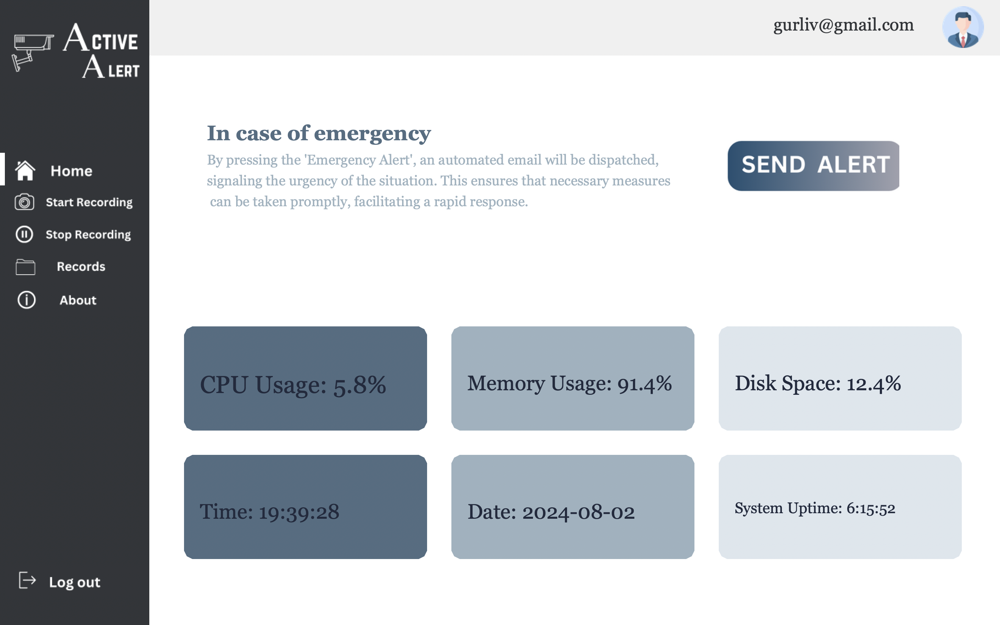
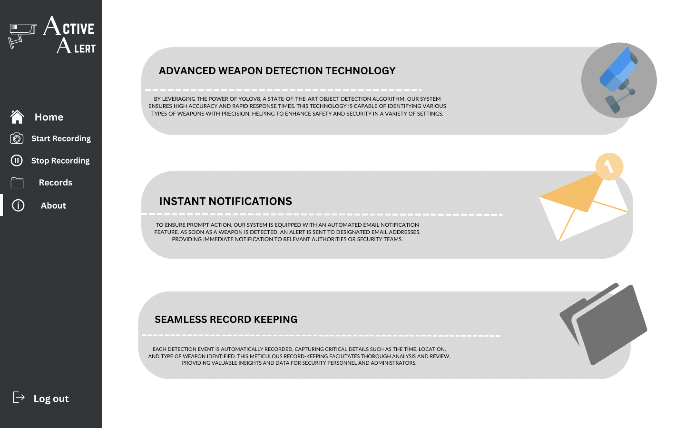
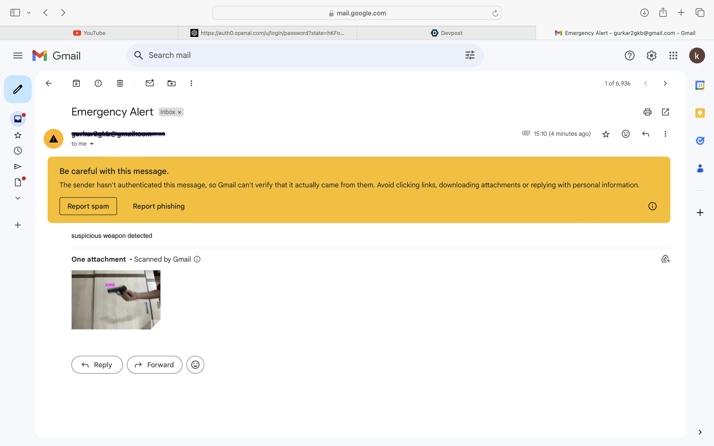
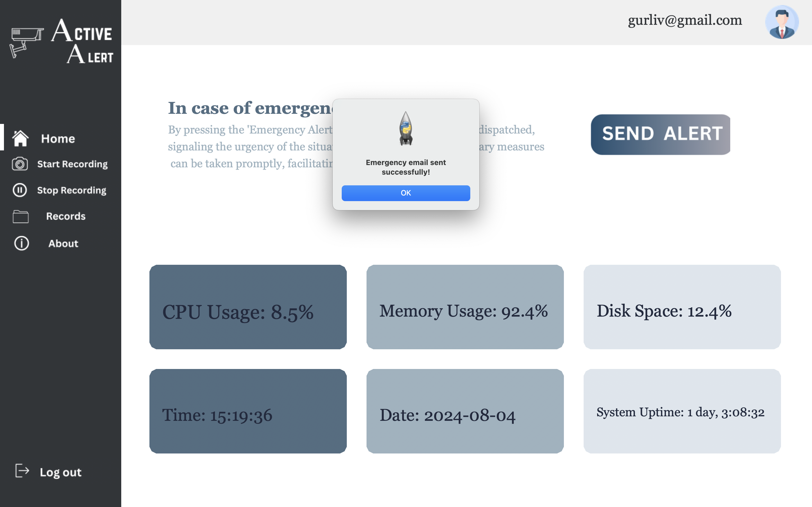
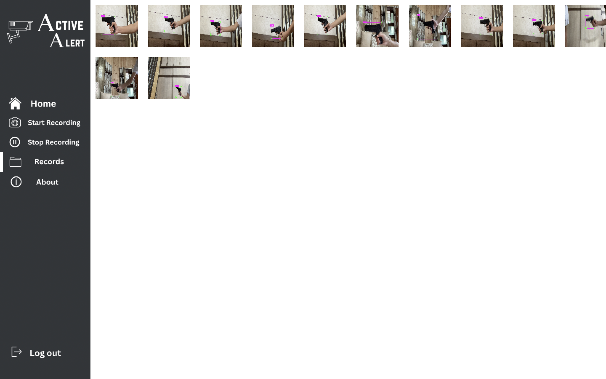

# Active Alert System

## Overview
The **Active Alert System** is a desktop application designed to detect various weapons using the YOLO (You Only Look Once) object detection model. Upon detection, it sends an emergency email with a screenshot of the detected object using the Gmail API. The application is designed to run on macOS, leveraging the power of Python, OpenCV, and machine learning models.

## Features
- **Weapon Detection:** Detects weapons such as grenades, guns, knives, pistols, handguns, and rifles using a trained YOLO model.
- **Real-Time Monitoring:** Continuously monitors the live camera feed and highlights detected weapons with bounding boxes.
- **Emergency Email Notifications:** Sends an emergency email with an attached screenshot whenever a weapon is detected.
- **Screenshot and Thumbnail Management:** Captures full-sized screenshots and creates thumbnails for quick viewing in the "Records" window.
- **User-Friendly Interface:** Offers a simple and intuitive UI with fullscreen capabilities.

## Installation

### Prerequisites
- **Python 3.7+**
- **pip** (Python package manager)

### Setup
1. **Clone the repository:**
   ```bash
   git clone https://github.com/Mansi9300/Active-Alert.git
   cd active-alert-system
   ```

2. **Install required dependencies:**
   ```bash
   pip install -r req.txt
   ```

3. **Set up the environment variables:**
   - Create a `.env` file in the root directory.
   - Add your Gmail API key and Gmail user details in the following format:
     ```
     API_KEY=your_gmail_api_key.json
     GMAIL_USER=your_email@gmail.com
     ```

4. **Download the YOLO model:**
   - Ensure that `best.pt` (the trained YOLO model file) is placed in the root directory or specify the correct path in the code.

5. **Run the application:**
   ```bash
   python main.py
   ```

## Usage
1. **Home:** The default window displaying the main UI.
2. **Start Recording:** Begins the real-time camera feed and weapon detection.
3. **Stop Recording:** Stops the real-time monitoring and returns to the Home screen.
4. **Records:** Displays thumbnails of detected weapons.
5. **About Us:** Displays information about the application.
6. **Log out:** Closes the application.

## How It Works
1. **Weapon Detection:** The application uses the YOLO model to detect predefined classes of weapons. When a weapon is detected with a confidence level above 60%, it highlights the object in the video feed.
2. **Emergency Alert:** A screenshot of the detected weapon is captured and sent as an attachment via email using the Gmail API.
3. **Thumbnails:** For each detection, a smaller thumbnail is created and displayed in the "Records" window for quick review.

## Technologies Used
- **Python**
- **OpenCV:** For real-time video processing.
- **YOLO:** For object detection.
- **Gmail API:** For sending email notifications.
- **Tkinter:** For the graphical user interface.

  ## Screenshots

|  |  |
|--------------|--------------|
|  |  |
|  |  |
|  |  |

